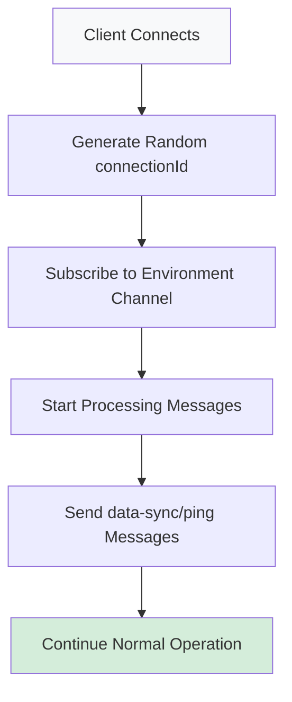
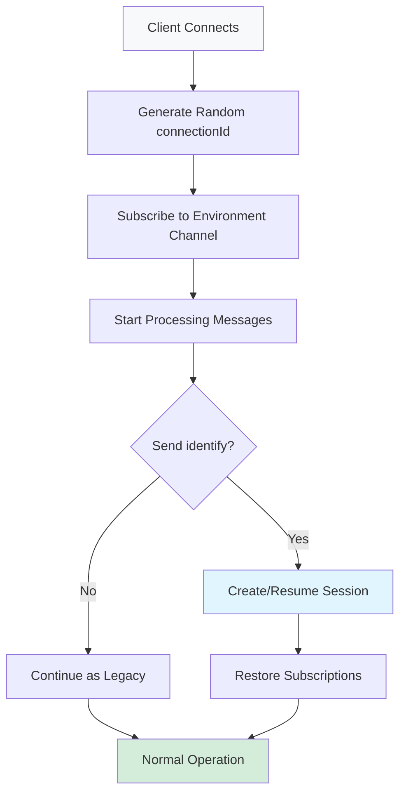

# Backward Compatibility Analysis

## ✅ **Full Backward Compatibility Guaranteed**

The session management system is designed as an **optional enhancement** that doesn't break existing clients.

## 🔄 **Dual Mode Operation**

### **Legacy Clients (Current Behavior)**


### **Modern Clients (With Session Management)**


## 🔍 **Current Connection Flow Analysis**

Looking at `HandleConnectionAsync()`, the current flow is:

```csharp
public async Task HandleConnectionAsync(ConnectionContext connection, CancellationToken token)
{
    var id = _subscriptionService.AddSubscription(webSocket);  // ← Random ID generated
    _connectionTimestamps[id] = DateTime.UtcNow;
    
    await SubscribeToBackplaneChannel(envId);                  // ← Auto-subscribe to env
    _subscriptionService.AddChannelToSubscription(id, envId); // ← Ready for messages
    
    await ProcessWebSocketMessages(...);                      // ← Start processing
}
```

**Key Point**: Clients are **immediately functional** without sending any identify message!

## 🎯 **Implementation Strategy**

### **1. Optional Identify Handling**

```csharp
// In HandleMessageAsync - NEW case added to existing switch
switch (messageType.ToString())
{
    case "data-sync":
        // ✅ Existing - works for all clients
        await HandleDataSyncMessage(...);
        break;
        
    case "ping":
        // ✅ Existing - works for all clients  
        await HandlePingMessage(...);
        break;
        
    case "identify":
        // 🆕 NEW - optional enhancement
        await HandleClientIdentify(...);
        break;
        
    default:
        // ✅ Unknown messages logged but don't break connection
        _logger.LogWarning("Unknown message type: {MessageType}", messageType);
        break;
}
```

### **2. Session Manager Graceful Degradation**

```csharp
public class ClientSessionManager 
{
    // Works with BOTH identified and anonymous connections
    public async Task<bool> AddChannelSubscriptionAsync(string connectionId, string channel)
    {
        // Try to get identified session
        if (_connectionToClient.TryGetValue(connectionId, out var clientId))
        {
            // 🎯 Enhanced: Persist to Redis for session resume
            await _sessionStore.AddChannelSubscriptionAsync(clientId, channel);
        }
        
        // ✅ Always works: Add to in-memory subscription service  
        _subscriptionManager.AddChannelToSubscription(connectionId, channel);
        
        return true; // Never fails due to missing identification
    }
}
```

## 📊 **Client Behavior Matrix**

| Client Type | Identify Message | Session Persistence | Channel Subscriptions | Feature Flags |
|-------------|------------------|--------------------|--------------------|---------------|
| **Legacy** | ❌ Not sent | ❌ Lost on disconnect | ✅ Works normally | ✅ Works normally |
| **Modern** | ✅ Sent | ✅ Survives reconnect | ✅ Auto-restored | ✅ Works normally |

## 🧪 **Test Scenarios**

### **Scenario 1: Legacy Client (No Changes)**
```javascript
// Existing client code - NO CHANGES NEEDED
const ws = new WebSocket('wss://featbit.com/ws');

ws.onopen = () => {
    // Immediately start using existing features
    ws.send(JSON.stringify({
        messageType: "data-sync",
        data: { /* feature flag request */ }
    }));
};

// ✅ Result: Works exactly as before
```

### **Scenario 2: Modern Client (Opt-in Enhancement)**  
```javascript
// Enhanced client - sends optional identify
const ws = new WebSocket('wss://featbit.com/ws');

ws.onopen = () => {
    // Optional: Send identify for session management
    ws.send(JSON.stringify({
        messageType: "identify",
        user: { keyId: "user-123" },
        envId: "env-456"
    }));
    
    // Then continue with normal operations
    ws.send(JSON.stringify({
        messageType: "data-sync", 
        data: { /* feature flag request */ }
    }));
};

// ✅ Result: Gets session management benefits + normal functionality
```

### **Scenario 3: Mixed Environment**
```
Load Balancer
     │
     ├── Server A: Legacy clients + Modern clients ✅
     ├── Server B: Legacy clients + Modern clients ✅  
     └── Server C: Legacy clients + Modern clients ✅

// All client types work on all servers
```

## ⚡ **Performance Impact**

### **Legacy Clients**
- **Zero overhead** - no additional processing
- **Same memory usage** - no session storage
- **Same throughput** - identical code path

### **Modern Clients**  
- **Minimal overhead** - optional Redis operations
- **Better UX** - session resume on reconnect
- **Enhanced reliability** - survives server failover

## 🔧 **Implementation Safeguards**

### **1. Fail-Safe Defaults**
```csharp
// Session operations never break basic functionality
public async Task HandleClientDisconnectAsync(string connectionId)
{
    try
    {
        // Enhanced: Clean up session if exists
        if (_connectionToClient.TryRemove(connectionId, out var clientId))
        {
            await _sessionStore.RemoveSessionAsync(clientId);
        }
    }
    catch (Exception ex)
    {
        // ⚠️ Session cleanup failure doesn't break disconnect handling
        _logger.LogWarning(ex, "Session cleanup failed for {ConnectionId}", connectionId);
    }
    
    // ✅ Always works: Basic subscription cleanup
    _subscriptionManager.RemoveSubscription(connectionId);
}
```

### **2. Configuration Control**
```json
{
  "SessionManagement": {
    "Enabled": true,           // Can disable if needed
    "RequireIdentify": false,  // Never require for compatibility  
    "SessionTTL": "24:00:00"   // Configurable cleanup
  }
}
```

## 🎯 **Migration Path**

### **Phase 1** ✅ (Current)
- Add session management infrastructure
- **Zero impact** on existing clients

### **Phase 2** 📋 (Upcoming)  
- Update WebSocket service to handle identify
- **Fully backward compatible**

### **Phase 3** 📋 (Future)
- Update client SDKs to send identify
- **Opt-in enhancement** for better UX

### **Phase 4** 📋 (Long-term)
- Advanced session features
- **Always optional** - never breaking

## ✅ **Guarantees**

1. **No Breaking Changes** - Existing clients continue working unchanged
2. **Optional Enhancement** - Identify message is completely optional  
3. **Graceful Degradation** - Session features fail safely to basic operation
4. **Performance Neutral** - Zero overhead for clients that don't use sessions
5. **Incremental Adoption** - Teams can migrate client-by-client at their own pace

## 🚀 **Bottom Line**

The session management is designed as a **pure enhancement layer** that:
- ✅ **Never breaks** existing functionality
- ✅ **Always maintains** backward compatibility  
- ✅ **Provides benefits** only when clients opt-in
- ✅ **Fails gracefully** if there are any issues

**Legacy clients will continue working exactly as they do today, with zero changes required.** 